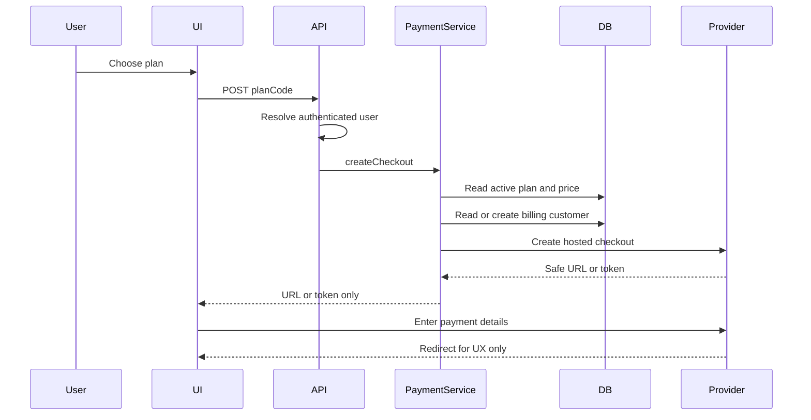
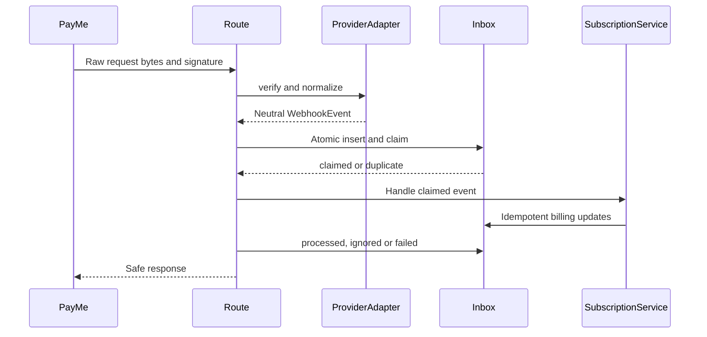

# Payment and subscription architecture

This document describes the provider-neutral billing foundation. PayMe is the
first adapter, but its external API calls are intentionally disabled until the
official account-specific integration contract is verified.

## Current pause (remaining unknowns)

Sandbox scaffolding is in place for `get-subscriptions`, `get-transactions`,
plan-driven S2S verification, dual plans (`studio_monthly` / `studio_yearly`),
and webhook inbox parsing. Checkout activation remains blocked.

Resolved officially:
- Subscription statuses (`sub_status` 1/2/3/4/5/6/76)
- Transaction statuses (`transaction_status` 1–11, complementary only)
- `POST /get-subscriptions` request/response DTOs

Still required before sandbox checkout calls:

1. Exact generate-subscription request field for our correlation id
   (PayMe echoes the value as `subscription_id`, outbound field name TBD)
2. Official subscription callback Content-Type
   (`application/json` vs `application/x-www-form-urlencoded`)

Until those are confirmed:

- `PAYMENTS_CHECKOUT_ENABLED=false` — UI shows disabled **זמין בקרוב**;
  `POST /api/payments/checkout` returns 503 before any provider or pending
  subscription work.
- `TRIAL_ENDING_REMINDERS_ENABLED=false` — master kill switch; cron route and
  schedule stay; job returns zeros with log `Trial reminders disabled.`
- When reminders are enabled and `PAYMENTS_CHECKOUT_ENABLED !== true`, the cron
  sends a soft **update** email (no payment CTA) to users with ≤3 days of trial
  left (`trial_end_date` in UTC `[today, today+4d)` and not yet expired),
  claiming `trial_ending_email_sent_at` once.
- When `PAYMENTS_CHECKOUT_ENABLED=true`, that update path is unused; the cron
  switches automatically to the **payment** reminder (exact UTC day+3 window +
  “המשך למנוי” link).
- `ENFORCE_SUBSCRIPTION_ACCESS=false` — documented only; not wired to
  middleware, layouts, or product guards. Expired trial users keep full access.
- `generate-subscription` builds the known payload then fails closed until the
  correlation field name is confirmed. Callbacks never activate billing without
  S2S + confirmed `sub_status` mapping.

## Safety boundary

- UI, authorization and user services call `PaymentService`, never PayMe.
- Provider credentials are read only by server modules.
- Card number, CVV, expiry and identity number are never accepted or stored.
- Prices are integer agorot from `subscription_plans`; a request cannot set a
  price or `userId`.
- A redirect from checkout never activates a subscription. Only a verified
  webhook can update financial state.
- Existing trial/referral behavior remains independent and is not gated by a
  paid subscription in this phase.

## Checkout



The current PayMe adapter returns `provider_not_configured` before any external
request. Hosted Payment Page is preferred; Hosted Fields/tokenization may be
used only after its PCI and API-key exposure model is verified officially.

## Webhook



`claim_payment_webhook_event` combines a unique `(provider,
provider_event_id)` inbox with an atomic state transition. Concurrent delivery
therefore has one processor. Failed events may be claimed again; transaction
and subscription writes use provider identifiers for idempotent upserts.

Authenticity verification is deliberately not implemented until PayMe's
official signature header, canonical bytes, algorithm and secret format are
known. The endpoint fails closed and does not persist unverified payloads.

## Tables

- `billing_customers`: local user to provider-customer mapping.
- `subscription_plans`: server-authoritative catalog. `studio_monthly` is
  seeded at 4,000 agorot, ILS, monthly.
- `subscriptions`: local lifecycle state and billing periods.
- `payment_transactions`: provider-neutral transaction ledger.
- `payment_webhook_events`: private verified-event inbox and processing log.

All billing writes require service role. Authenticated users can select only
safe columns from their own subscriptions and transactions. `provider_metadata`,
`raw_metadata` and webhook payloads are not granted to client roles.

## Status and failed charges

`SubscriptionService` owns lifecycle transitions. Successful verified events
activate or renew; failed charges set `payment_failed` or `past_due`. They do
not delete data or immediately block access. The prepared grace period is seven
days (`PAYMENT_FAILURE_GRACE_PERIOD_DAYS`), but `hasActiveSubscription` is not
wired to middleware or product permissions until enforcement is approved.

The local database is the fast source for subscription status. PayMe is the
source of verified financial events, not a dependency on every page load.

## Adding a provider

1. Add an adapter under `lib/payments/providers/<provider>/`.
2. Implement every `PaymentProvider` method and keep external payload types
   inside that directory.
3. Map provider events to the neutral business event names.
4. Add the adapter to `provider-factory.ts`.
5. Add server-only environment validation and a webhook route.
6. Add mapper, signature, factory and lifecycle tests.
7. Do not add provider columns to `users`; use provider identifiers in billing
   tables.

## Environment

```text
PAYMENT_PROVIDER=payme
PAYME_API_BASE_URL=
PAYME_CLIENT_KEY=
PAYME_SELLER_ID=
PAYME_WEBHOOK_SECRET=
NEXT_PUBLIC_APP_URL=https://your-app.example
TRIAL_ENDING_REMINDERS_ENABLED=false
PAYMENTS_CHECKOUT_ENABLED=false
ENFORCE_SUBSCRIPTION_ACCESS=false
ONE_TIME_PAYMENT_ENABLED=false
ONE_TIME_PAYMENT_REMINDERS_ENABLED=false
ONE_TIME_PAYMENT_EXPIRED_EMAIL_ENABLED=false
```

Only the exact string `true` enables each feature flag. Unset / `false` / any
other value keeps the feature off.

`PAYMENTS_SMOKE_TEST_USER_ID` is a production-only checkout allowlist for a
single internal test user. When `PAYMENTS_CHECKOUT_ENABLED=false`, only the
exact user ID configured in `PAYMENTS_SMOKE_TEST_USER_ID` may reach PayMe
checkout, and only for the `studio_monthly` plan.

When `PAYMENTS_CHECKOUT_ENABLED=false`, all other users keep the disabled
"זמין בקרוב" checkout experience and cannot send a payment request.

This exception is intended for controlled production smoke testing only, and
it requires `PAYME_ENV=production` with `PAYME_API_BASE_URL=https://live.payme.io/api`.
The real `studio_monthly` catalog price remains 4,000 agorot in the database.

## SUMIT recurring subscriptions — PaymentsJS (current)

The `beginredirect` two-step (`createCheckoutSession` → `completeHostedCheckout`)
is **abandoned for recurring**. It captured the card with `AuthoriseOnly: 'true'`
for the plan's full price; SUMIT support confirmed an authorise-only transaction
for a subscription's amount makes SUMIT auto-cancel the standing order (commit
`476ff86`, 20/08/2026, changed the capture from a ₪1 placeholder to the real
price and broke every recurring signup after 23/08 — customers charged, no
subscription). SUMIT's own plugin labels redirect "בלי תמיכה בהוראות קבע".

The live flow is **in-site PaymentsJS**:

1. `components/dashboard/subscription/SumitCardForm.tsx` loads
   `https://app.sumit.co.il/scripts/payments.js`, renders card fields with
   `data-og` attributes (uncontrolled, no `name` — the PAN/CVV never touch React
   state or our server), and calls `OfficeGuy.Payments.CreateToken({ CompanyID,
   APIPublicKey, FormSelector, ResponseCallback })`.
2. On `Status === 0` it POSTs only `{ planCode, token }` (the single-use
   `Data.SingleUseToken`) to `POST /api/payments/subscription/charge`.
3. `PaymentService.subscribeWithToken` upserts a `pending` row, then
   `SumitProvider.createSubscription` makes ONE `/billing/recurring/charge/`
   call with `SingleUseToken` + `Duration_Months` (1 / 12) + `Recurrence: ''` +
   `Payments_Count: '1'` — charges the card AND opens the standing order.
4. On success the row goes straight to `active` with `provider_subscription_id
   = <customerId>:<recurringItemId>` and a `succeeded` `payment_transactions`
   row; on failure the row stays `pending`, a `failed` transaction is recorded,
   and the SUMIT message is surfaced. No redirect, no callback route.

Gated by `SUMIT_PAYMENTSJS_ENABLED` (+ `NEXT_PUBLIC_SUMIT_COMPANY_ID` /
`NEXT_PUBLIC_SUMIT_API_PUBLIC_KEY`). While off, the plan card falls back to the
one-time flow below. Renewals: SUMIT auto-charges on `Date_NextBilling` and
emails the customer; there is no SUMIT webhook, so period-end reconciliation is
a follow-up cron using `getSubscription` / `listforcustomer`.

## One-time payment (דיירקט cards)

Some customers pay with an immediate-debit card ("דיירקט") that a bank/issuer
will not let hold a standing recurring authorization — the regular SUMIT
checkout flow (`createCheckoutSession` → `completeHostedCheckout`, which
always calls `/billing/recurring/charge/`) fails for them for that reason,
not because of anything this codebase controls.

`createOneTimeCheckoutSession` / `completeOneTimeCheckout` in
`lib/payments/providers/sumit/sumit-provider.ts` are a separate flow for
these customers: `beginredirect` is called with `AuthoriseOnly: 'false'`
instead of `'true'`, which — per SUMIT's own documented behavior on that
endpoint — performs a real, final, single charge with no "make this
recurring" request at all. `/billing/recurring/charge/` is never called, so
no standing authorization is ever asked of the card issuer. The resulting
subscription row has `payment_type = 'one_time'`; `current_period_end` is
set locally (now + the plan's billing interval) since SUMIT tracks no period
for a bare payment, and nothing renews it automatically.

**Not yet independently live-tested with `AuthoriseOnly: 'false'`** in this
codebase — only the `'true'` capture path has a confirmed live test (see the
class doc in `sumit-provider.ts`). Run a real smoke-test charge with a real
דיירקט card before enabling `ONE_TIME_PAYMENT_ENABLED=true` for customers,
same posture as `PAYMENTS_SMOKE_TEST_USER_ID` for the recurring flow. Two
independent cron jobs (`lib/subscriptions/one-time-payment-reminders.ts`,
`lib/subscriptions/one-time-payment-expired-notifications.ts`, wired into
`app/api/cron/trial-ending-reminders/route.ts`) send a 3-days-left reminder
and a day-zero "moved to free plan" email, both with an upgrade CTA —
mirroring the trial reminder/expired pair.

## PayMe TODO before enabling external calls

Confirm from official PayMe documentation/account support:

1. Sandbox and production base URLs.
2. Credential names, seller/account identifier and authentication headers.
3. Hosted Payment Page versus supported tokenization flow for recurring
   subscriptions.
4. Create-customer, checkout, subscription, lookup, cancellation and payment
   method update endpoints, methods, request fields and response fields.
5. Whether recurring billing is provider-managed and how a plan/recurrence is
   represented.
6. Webhook registration URL and allowed HTTP response/retry behavior.
7. Signature header, algorithm, timestamp/replay protection, raw-body
   canonicalization and webhook secret format.
8. Stable event ID and provider customer/subscription/transaction identifiers.
9. Exact event names and fields corresponding to:
   `subscription.created`, `subscription.activated`,
   `subscription.renewed`, `subscription.payment_failed`,
   `subscription.cancelled`, `payment.succeeded`, `payment.failed` and
   `payment.refunded`.
10. Sandbox test cards/payment methods, 3DS behavior, failed-charge fixtures,
    refund workflow, webhook resend tool and any IP allowlist.
11. Approved return/cancel URL configuration and whether credentials may ever
    be browser-visible. The current design assumes they may not.

## Sandbox procedure

1. Create a separate PayMe sandbox account and Supabase local/sandbox project.
2. Fill sandbox secrets in `.env.local`; never use production keys.
3. Inspect the migration without applying it:
   `npx supabase db push --dry-run --local`.
4. Apply only to local development with `npx supabase migration up --local`,
   or, after separate explicit approval, to a selected sandbox.
5. Regenerate Supabase types if the schema changes from this prepared contract.
6. Configure the sandbox webhook URL:
   `/api/payments/webhooks/payme`.
7. Run `npm test` and `npx tsc --noEmit`.
8. Test success, decline, retry, duplicate webhook, cancellation, refund and
   unknown verified event. Confirm no card data or secrets appear in database,
   responses or logs.

## Local verification status — 2026-08-05

- Supabase CLI `2.111.0` was detected.
- `npx supabase status --output json` reported that Docker and Podman were not
  installed or not available on `PATH`.
- `npx supabase db push --dry-run --local` was attempted and failed safely with
  `ECONNREFUSED 127.0.0.1:54322`; it did not contact or change a remote project.

Dry-run output:

```text
DRY RUN: migrations will *not* be pushed to the database.
Connecting to local database...
LegacyDbConnectError: failed to connect to postgres at 127.0.0.1:54322
(ECONNREFUSED). Make sure Docker is running, then run: supabase start
```

- The local migration was therefore not applied, schema introspection and live
  RLS tests could not run, and no remote fallback was attempted.
- `npm test` passed, including eleven payment tests and explicit fail-closed
  coverage. `npx tsc --noEmit` passed.
- The configured `npm run lint` command did not complete because `next lint`
  opened Next.js's first-time interactive ESLint setup; the repository has no
  ESLint configuration file. IDE diagnostics reported no errors in changed
  files. Lint configuration was not changed as part of this database task.
- The migration review removed a redundant `billing_customers(user_id)` index:
  the unique `(user_id, provider)` index already serves that prefix.
- Owner-only SELECT access was added for safe `billing_customers` columns.
  `provider_customer_id` remains unavailable to client roles.
- `scripts/test-payments-rls-local.mjs` now covers two-user isolation, forbidden
  client mutations, active-plan visibility, private webhook/metadata fields,
  and required service-role writes. It refuses non-local URLs.

After Docker Desktop is installed and running:

```powershell
npx supabase start
npx supabase db push --dry-run --local
npx supabase migration up --local
npx supabase status -o env
npm run test:payments-rls:local
```

Pass the three local values printed by `supabase status -o env` as
`SUPABASE_LOCAL_URL`, `SUPABASE_LOCAL_ANON_KEY` and
`SUPABASE_LOCAL_SERVICE_ROLE_KEY` in the process environment. Do not commit or
print them.

**Production warning:** this migration has not been applied to production.
No `db push`, migration repair, reset or other remote command was run.
